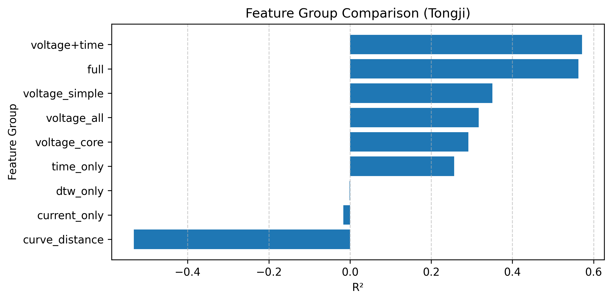
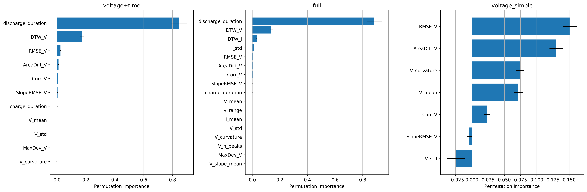
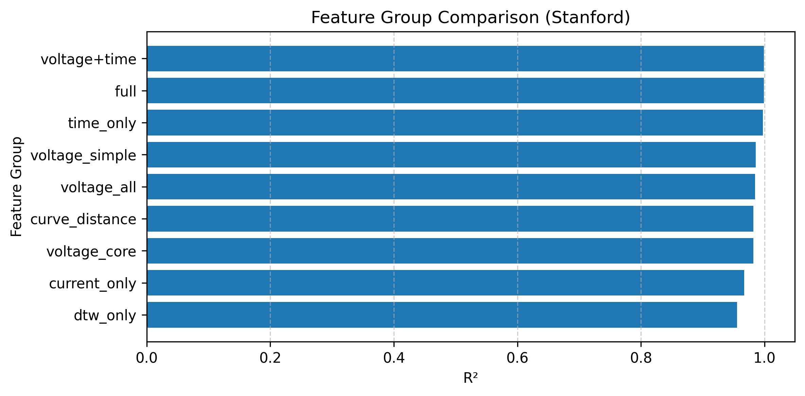
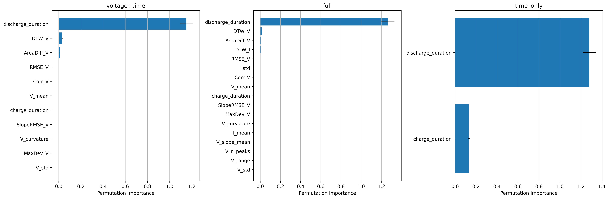

# Battery State of Health Prediction using Machine Learning

## Overview

This project investigates how machine learning can be used to predict the State of Health (SOH) of lithium-ion batteries from operational cycling data.

Instead of relying on direct capacity measurements, which require complete charge/discharge cycles, this project estimates SOH using electrical signals that are continuously available during battery operation, such as voltage, current, and time-derived features.

The project demonstrates an end-to-end data science workflow, including feature engineering, model development, hyperparameter optimization, and model interpretation.


## Project Goal

The objective of this project is to predict the State of Health (SOH) from operational battery data collected during charge/discharge cycles.

The target variable is

SOH = Remaining Capacity / Initial Capacity

where the battery capacity is calculated from the transferred charge (current integrated over time) during a cycle.

The models are trained using measurements such as

- Voltage
- Current
- Time
- Engineered statistical features

The ultimate goal is to estimate battery health without requiring direct capacity measurements.

## Features

- Battery SOH prediction using Random Forest regression
- Feature engineering from battery cycling data
- Evaluation of different feature groups
- Hyperparameter optimization with Grid Search
- Model evaluation using MAE and R²
- Feature importance analysis using Permutation Importance

## Dataset

This project uses the preprocessed **BatteryLife** dataset provided by the **BatteryML** project.

The following subsets are used:

- HUST
- Tongji (TJU)

The original datasets contain battery cycling measurements including

- Voltage
- Current
- Time

This project starts from the preprocessed data supplied by BatteryML. The focus is therefore on feature engineering, feature selection, machine learning, and model interpretation rather than raw data cleaning.

The engineered feature tables generated during preprocessing are stored in the `engineered_data/` directory.

### Dataset Structure

Each battery cell in the BatteryLife dataset is stored as a dictionary containing metadata, cycling measurements, and test protocol information.

| Variable | Type | Description |
|----------|:----:|-------------|
| `cell_id` | `str` | Unique identifier of the battery cell. |
| `cycle_data` | `list` | List containing the measurement data for each charge/discharge cycle. |
| `form_factor` | `str` | Battery cell form factor (e.g., cylindrical, pouch, prismatic). |
| `anode_material` | `str` | Anode material. |
| `cathode_material` | `str` | Cathode material. |
| `electrolyte_material` | `str` | Electrolyte material (if available). |
| `nominal_capacity_in_Ah` | `float` | Nominal cell capacity in ampere-hours (Ah). |
| `depth_of_charge` | `float` | Maximum state of charge (SOC) reached during cycling. |
| `depth_of_discharge` | `float` | Minimum state of charge (SOC) reached during cycling. |
| `already_spent_cycles` | `int` | Number of cycles completed before measurements started. |
| `max_voltage_limit_in_V` | `float` | Maximum voltage limit during cycling. |
| `min_voltage_limit_in_V` | `float` | Minimum voltage limit during cycling. |
| `max_current_limit_in_A` | `float` | Maximum current limit during cycling (if available). |
| `min_current_limit_in_A` | `float` | Minimum current limit during cycling (if available). |
| `reference` | `str` / `None` | Reference to the original publication or data source. |
| `description` | `str` | Additional information about the battery cell or experiment. |
| `charge_protocol` | `list` | Charging protocol describing the charging procedure. |
| `discharge_protocol` | `list` | Discharging protocol describing the discharging procedure. |
| `SOC_interval` | `list` | SOC interval used during measurements. |

#### `cycle_data` Structure

Each element of `cycle_data` corresponds to one charge/discharge cycle and contains the measured time-series data.

| Variable | Type | Description |
|----------|:----:|-------------|
| `current_in_A` | `list` | Current measurements in amperes (A). |
| `voltage_in_V` | `list` | Voltage measurements in volts (V). |
| `charge_capacity_in_Ah` | `list` | Accumulated charge capacity during charging (Ah). |
| `discharge_capacity_in_Ah` | `list` | Accumulated discharge capacity during discharging (Ah). |

## Requirements

- Python 3.13
- uv package manager

The project dependencies are defined in `pyproject.toml`.

## Installation

This project uses `uv` for dependency management.

Clone the repository:

```bash
git clone https://github.com/ChristophReimuth/battery-soh-prediction.git
cd battery-soh-prediction
```

Install dependencies and start Jupyter:

```bash
uv sync
uv run jupyter notebook
```

`uv run` automatically uses the project's virtual environment, no manual activation required.

<details>
<summary>Manual venv activation (optional)</summary>

If you prefer to activate the environment yourself:

```bash
uv sync

# Windows
.venv\Scripts\activate

# Linux / macOS
source .venv/bin/activate

jupyter notebook
```

</details>

## Usage

The project workflow is organized into three main notebooks:

1. **battery_soh_data_preprocessing.ipynb**
   - Load and preprocess the battery dataset
   - Perform data cleaning and preparation
   - Generate engineered features from battery measurement data
   - Export processed feature tables for model training

2. **baseline_model.ipynb**
   - Train a **Linear Regression** baseline model
   - Evaluate model performance using MAE and R²
   - Visualize predicted versus measured SOH values

3. **feature_importance.ipynb**
   - Train Random Forest regression models
   - Compare different feature groups and model configurations
   - Evaluate model performance
   - Analyze the contribution of individual features using Permutation Feature Importance

### Recommended workflow

Run the notebooks in the following order:

1. `battery_soh_data_preprocessing.ipynb`  
   → prepares the datasets and generates the required input features

2. `baseline_model.ipynb`  
   → establishes baseline model performance

3. `feature_importance.ipynb`  
   → performs advanced model comparison and feature analysis

## Project Workflow

```text
BatteryLife Dataset (BatteryML)
        │
        ▼
Data Preprocessing
        │
        ▼
Feature Engineering
        │
        ▼
Feature Group Definition
        │
        ▼
Random Forest Training
        │
        ▼
Grid Search Hyperparameter Optimization
        │
        ▼
Performance Evaluation (MAE, R²)
        │
        ▼
Permutation Feature Importance
        │
        ▼
Feature Interpretation
```


## Project Structure

```
.
├── engineered_data/
│   ├── processed_battery_features_HUST.pkl (not uploaded)
│   └── processed_battery_features_Tongji.pkl (not uploaded)
│
├── figures/
│   ├── feature_group_comparison_HUST.png
│   ├── feature_group_comparison_Tongji.png
│   ├── linear_regression_baseline_HUST.png
│   ├── linear_regression_baseline_Tongji.png
│   ├── permutation_top3_HUST.png
│   └── permutation_top3_Tongji.png
│
├── notebooks/
│   ├── battery_soh_data_preprocessing.ipynb
│   ├── baseline_model.ipynb
│   └── feature_importance.ipynb
│
├── src/
│   └── battery_aging/
│       ├── data_preprocessing.py
│       ├── feature_engineering.py
│       ├── model_functions.py
│       └── __init__.py
│
├── .gitignore
├── .python-version
├── pyproject.toml
├── README.md
└── uv.lock
```

## Machine Learning Pipeline


The machine learning pipeline consists of

- Feature engineering from battery cycling data
- Definition of multiple feature groups
- Random Forest regression
- Hyperparameter optimization using Grid Search
- Performance evaluation using MAE and R²
- Comparison of feature groups
- Interpretation using Permutation Feature Importance

The central research question is:

> Which engineered battery features provide the most accurate prediction of battery State of Health?

## Feature Groups

Several feature groups are evaluated to quantify the predictive value of different battery measurements.

The investigated groups include

- Voltage statistics
- Voltage curve similarity metrics (DTW, RMSE, Correlation, Area Difference, etc.)
- Current statistics
- Time-based features
- Combined feature sets

Each feature group is used to train an independently optimized Random Forest model.

## Results (HUST Dataset)

The project first establishes a **Linear Regression** baseline before evaluating more advanced **Random Forest** models with different engineered feature groups.

Model performance is evaluated using

- Mean Absolute Error (MAE)
- Coefficient of Determination (R²)

### Baseline Model (Linear Regression)

> **Note:** The results presented below are currently based on the **HUST** subset of the BatteryLife dataset. 

The baseline Linear Regression model achieved the following performance on the test set:

| Metric | Value |
|--------|------:|
| Mean Absolute Error (MAE) | **0.0174** |
| Coefficient of Determination (R²) | **0.9046** |

The baseline already demonstrates that the engineered features contain strong predictive information for battery State of Health (SOH), explaining approximately **90% of the variance** in the observed SOH values.

### Random Forest Models (HUST Dataset)

Random Forest regression models were subsequently trained using different feature groups and optimized via Grid Search. Their performance was compared to determine which engineered battery features provide the most accurate SOH prediction.


| Feature Group | MAE | R² |
|---------------|----:|---:|
| **Full Feature Set** | **0.0055** | **0.9865** |
| Voltage (All) | 0.0082 | 0.9670 |
| Voltage + Time | 0.0079 | 0.9663 |
| Curve Distance Features | 0.0108 | 0.9457 |
| Voltage Statistics | 0.0145 | 0.9165 |
| Core Voltage Features | 0.0202 | 0.8631 |
| Time Only | 0.0333 | 0.6225 |
| DTW Only | 0.0369 | 0.5939 |
| Current Only | 0.0405 | 0.4325 |

The **Full Feature Set** achieved the best performance with an **MAE of 0.0055** and an **R² of 0.9865**, substantially outperforming the Linear Regression baseline. Among the individual feature groups, voltage-based features provided the highest predictive power, while current-only and time-only features were considerably less informative.


### Permutation Feature Importance (HUST Dataset)

Permutation Feature Importance was used to interpret the Random Forest models and identify the features that contribute most to SOH prediction.

The analysis shows that **voltage curve similarity features** are the most informative predictors of battery State of Health. In particular, the **voltage curve area difference (AreaDiff_V)** consistently emerged as the dominant feature across all evaluated models. Other voltage-based similarity metrics, such as maximum deviation, Dynamic Time Warping (DTW), RMSE, and correlation, also contributed substantially to the model's performance.

By comparison, simple statistical descriptors of voltage and current, as well as time-based features, had a considerably smaller impact on the predictions, indicating that the overall shape of the voltage curve contains the most relevant information about battery degradation.

<p align="center">
  
</p>


## Results (Tongji Dataset)

The same machine learning pipeline was evaluated on the **Tongji** subset of the BatteryLife dataset to assess the robustness of the proposed feature engineering approach across different battery datasets.

Model performance was evaluated using:

- Mean Absolute Error (MAE)
- Coefficient of Determination (R²)

### Baseline Model (Linear Regression)

The baseline Linear Regression model was evaluated on the Tongji test set before applying more advanced Random Forest models.

The model achieved the following performance:

| Metric | Value |
|--------|------:|
| Mean Absolute Error (MAE) | **0.0273** |
| Coefficient of Determination (R²) | **0.8248** |

The baseline model already demonstrates that the engineered features contain substantial predictive information for battery State of Health (SOH). With an **R² value of 0.8248**, the linear model explains more than **82% of the variance** in the observed SOH values.

However, the subsequent Random Forest models reveal that the relationship between engineered battery features and SOH is partly nonlinear. By capturing more complex feature interactions, the Random Forest models improve the prediction performance for selected feature combinations.

### Random Forest Models (Tongji Dataset)

Random Forest regression models were trained using the same engineered feature groups as for the HUST dataset. The results show that feature combinations including voltage information and temporal information provide the most reliable SOH prediction capability.

| Feature Group | MAE | R² |
|---------------|----:|---:|
| **Voltage + Time** | **0.0470** | **0.5712** |
| **Full Feature Set** | **0.0472** | **0.5628** |
| Voltage Statistics | 0.0539 | 0.3506 |
| Voltage (All) | 0.0553 | 0.3170 |
| Core Voltage Features | 0.0576 | 0.2917 |
| Time Only | 0.0622 | 0.2564 |
| Current Only | 0.0718 | -0.0166 |
| DTW Only | 0.0738 | -0.0014 |
| Curve Distance Features | 0.0830 | -0.5324 |

The best-performing model on the Tongji dataset was the **Voltage + Time feature set**, achieving an **MAE of 0.0470** and an **R² of 0.5712**. The complete feature set achieved a very similar performance with an **MAE of 0.0472** and an **R² of 0.5628**.

Compared to the HUST dataset, the prediction accuracy is lower, indicating that the Tongji dataset presents a more challenging prediction task. Voltage-based features remain the most informative feature group, but individual voltage similarity metrics and current-based features provide limited predictive value when used alone.




### Permutation Feature Importance (Tongji Dataset)

Permutation Feature Importance was used to analyze which engineered features contribute most to the Random Forest predictions on the Tongji dataset.

The results show that **time-related discharge behavior and voltage curve similarity features dominate the SOH prediction**. In particular, **discharge duration** is by far the most influential feature for both the Voltage + Time model and the Full Feature Set model, indicating a strong relationship between battery aging and discharge behavior.

For the **Voltage + Time model**, discharge duration accounts for the majority of the predictive contribution, followed by voltage curve similarity metrics such as **Dynamic Time Warping (DTW_V)** and **RMSE_V**. Other voltage characteristics, including area difference, correlation, and slope-based features, provide only minor additional information.

The **Full Feature Set model** shows a similar pattern. Discharge duration remains the dominant feature, while **DTW_V** represents the second most important predictor. Current-based information contributes only marginally, with **DTW_I** and **I_std** providing smaller improvements compared to the dominant discharge and voltage-related features.

Compared to the HUST dataset, the Tongji results indicate a shift in feature importance: while voltage curve area differences were the strongest predictors for HUST, the Tongji dataset is primarily driven by **discharge duration and voltage curve alignment features**. This suggests that degradation characteristics differ between datasets and that the most informative features depend on the underlying battery population and measurement conditions.

<p align="center">
  
</p>


## Results (Stanford Dataset)

The same machine learning pipeline was evaluated on the **Stanford** subset of the BatteryLife dataset to assess the robustness of the proposed feature engineering approach across different battery datasets.

Model performance was evaluated using:

- Mean Absolute Error (MAE)
- Coefficient of Determination (R²)

### Baseline Model (Linear Regression)

The baseline Linear Regression model was evaluated on the Stanford test set before applying more advanced Random Forest models.

The model achieved the following performance:

| Metric | Value |
|--------|------:|
| Mean Absolute Error (MAE) | **0.0042** |
| Coefficient of Determination (R²) | **0.9991** |

The baseline model demonstrates that the engineered features capture a highly consistent relationship with battery State of Health (SOH) for the Stanford dataset. With an **R² value of 0.9991**, the linear model explains nearly all variance in the observed SOH values.

Compared to the HUST and Tongji datasets, the Stanford dataset shows substantially higher baseline prediction accuracy. This indicates that the extracted features provide a particularly strong representation of the degradation behavior within this battery population.

However, the high linear baseline performance should be interpreted considering the specific dataset characteristics, including battery type, cycling protocol, and measurement conditions. Further evaluation using Random Forest models is required to determine whether nonlinear feature interactions provide additional predictive improvements beyond the linear relationship already captured by the engineered features.

### Random Forest Models (Stanford Dataset)

Random Forest regression models were trained using the same engineered feature groups as for the HUST and Tongji datasets. The results demonstrate that voltage and temporal features provide highly accurate SOH prediction capability for the Stanford dataset.

| Feature Group | MAE | R² |
|---------------|----:|---:|
| **Voltage + Time** | **0.0037** | **0.9991** |
| **Full Feature Set** | **0.0038** | **0.9991** |
| Time Only | 0.0066 | 0.9970 |
| Voltage (All) | 0.0127 | 0.9849 |
| Voltage Statistics | 0.0129 | 0.9858 |
| Core Voltage Features | 0.0138 | 0.9817 |
| Curve Distance Features | 0.0151 | 0.9819 |
| Current Only | 0.0195 | 0.9672 |
| DTW Only | 0.0271 | 0.9555 |

The best-performing model on the Stanford dataset was the **Voltage + Time feature set**, achieving an **MAE of 0.0037** and an **R² of 0.9991**. The **Full Feature Set** achieved a comparable performance with an **MAE of 0.0038** and an **R² of 0.9991**, indicating that additional current-based and curve-distance features provide only limited additional predictive value.

Compared to the HUST and Tongji datasets, the Stanford results show a substantially higher prediction accuracy across nearly all feature groups. Even single feature categories, such as time-related features, achieve excellent performance, suggesting that the degradation trajectory in the Stanford dataset is highly consistent and strongly correlated with measurable cycling characteristics.

The similar performance of the Voltage + Time and Full Feature Set models indicates that voltage evolution and temporal discharge behavior already capture the dominant degradation information. Additional features, including current-based descriptors and DTW-based similarity measures, contribute only marginal improvements.




### Permutation Feature Importance (Stanford Dataset)

Permutation Feature Importance was used to analyze which engineered features contribute most to the Random Forest predictions on the Stanford dataset.

The results show that **time-related discharge behavior is the dominant predictor for SOH estimation**. In particular, **discharge duration** accounts for by far the largest contribution in all evaluated feature sets, indicating a strong correlation between battery degradation and changes in discharge behavior.

For the **Voltage + Time model**, discharge duration represents the most influential feature by a large margin. Voltage curve similarity features, especially **Dynamic Time Warping (DTW_V)** and **AreaDiff_V**, provide additional predictive information but contribute considerably less compared to the dominant temporal feature. Other voltage characteristics, including RMSE, correlation, and slope-based features, have only minor influence on the model predictions.

The **Full Feature Set model** shows a similar pattern. Discharge duration remains the dominant feature, followed by **DTW_V**, **AreaDiff_V**, and **DTW_I**. Current-based features provide only limited additional information, with DTW_I contributing slightly more than other current-related descriptors such as I_std and I_mean.

Compared to the HUST and Tongji datasets, the Stanford results indicate an even stronger dependency on discharge behavior. While voltage curve characteristics such as area differences were highly relevant for HUST and voltage alignment features contributed substantially for Tongji, the Stanford dataset is primarily characterized by the strong predictive power of discharge duration. This suggests that the degradation trajectory within the Stanford battery population is highly consistent and that temporal discharge behavior captures a large fraction of the underlying aging process.

<p align="center">
  
</p>


### Discharge Protocol Comparison

The discharge protocols of the HUST, Tongji, and Stanford datasets were compared to investigate whether differences in cycling conditions may explain the observed variations in feature importance across datasets.

The comparison reveals substantial differences in protocol diversity:

| Dataset | Unique Discharge Protocols | Cells |
|----------|---------------------------:|------:|
| Stanford | **1** | 41 |
| HUST | **77** | 77 |
| Tongji | **1** | 130 |

The **Stanford** dataset uses a single, standardized discharge protocol for all battery cells, corresponding to a **0.75 C constant-current discharge**. Likewise, the **Tongji** dataset applies one common discharge protocol across all 130 cells. In contrast, the **HUST** dataset contains **77 unique discharge protocols**, indicating that nearly every cell was cycled under a different discharge condition.

The large protocol variability in the HUST dataset introduces greater diversity in the measured voltage and current responses. Consequently, voltage-based features such as **AreaDiff_V**, **DTW_V**, and other curve similarity metrics become more informative for SOH prediction, as the model must account for variations introduced by different operating conditions.

Conversely, the highly standardized discharge protocols in the Stanford and Tongji datasets reduce protocol-induced variability, allowing temporal characteristics such as **discharge duration** to become stronger predictors of battery degradation. This observation is consistent with the permutation feature importance analysis, where **discharge duration** was identified as the dominant feature for both datasets.

Overall, these results demonstrate that the effectiveness of engineered features depends not only on the machine learning model but also on the underlying experimental cycling protocol. Differences in discharge conditions should therefore be considered when comparing SOH prediction performance across battery datasets.


### Discharge Protocol Comparison

The comparison of the recorded discharge protocols provides an initial indication that differences in experimental conditions may influence the predictive importance of engineered features.

While both the Stanford and Tongji datasets contain a single recorded discharge protocol for all cells, the HUST dataset consists of multiple discharge protocols. This suggests that the variability of cycling conditions differs substantially between the datasets. However, the recorded protocol information alone is not sufficient to fully characterize the actual cycling conditions. A detailed analysis of the measured current and voltage profiles is therefore required to verify the extent to which the discharge conditions vary within each dataset.

The observed protocol homogeneity in the Stanford dataset may partly explain the exceptionally high prediction accuracy obtained by both the Linear Regression and Random Forest models. Under highly standardized experimental conditions, features such as **discharge duration** can become strongly correlated with battery state of health (SOH). Such correlations allow machine learning models to achieve very accurate predictions on the corresponding dataset.

However, these correlations may be dataset-specific rather than universally representative of battery degradation. Consequently, excellent performance on a homogeneous dataset does not necessarily imply improved generalization to batteries operating under different discharge conditions or real-world usage profiles. Instead, the models may partially learn relationships that are specific to the experimental protocol rather than intrinsic degradation mechanisms.

These observations motivate a more detailed comparison of the actual discharge current and voltage profiles to assess whether protocol-induced correlations contribute to the observed prediction performance.

### Discharge Protocol Comparison

The discharge protocols of the HUST, Tongji, and Stanford datasets were compared to investigate whether differences in cycling conditions may contribute to the observed variations in feature importance and prediction performance (see compare_discharge_protocols.ipynb).

The comparison reveals substantial differences in protocol diversity:

| Dataset | Unique Discharge Protocols | Cells |
|----------|---------------------------:|------:|
| Stanford | **1** | 41 |
| HUST | **77** | 77 |
| Tongji | **1** | 130 |

The recorded metadata indicate that all Stanford cells share the same discharge protocol (0.75 C constant-current discharge), while all Tongji cells also share a single recorded protocol. In contrast, the HUST dataset contains **77 unique discharge protocols**, suggesting considerably greater variation in experimental conditions.

This observation provides an initial indication that protocol variability may influence the predictive importance of the engineered features. Under highly standardized cycling conditions, features such as **discharge duration** can become strongly correlated with battery State of Health (SOH), allowing both linear and nonlinear models to achieve very high prediction accuracy. This behavior is consistent with the permutation feature importance analysis, where **discharge duration** was identified as the dominant predictor for both the Stanford and Tongji datasets.

Conversely, the higher protocol diversity in the HUST dataset introduces additional variability in the measured voltage and current responses. As a result, voltage-based descriptors such as **AreaDiff_V**, **DTW_V**, and other curve similarity metrics become more informative for capturing degradation behavior across different operating conditions.

It should be noted that the recorded discharge protocols provide only an initial indicator of the experimental setup. The actual variation in cycling conditions should be verified by analyzing the measured current and voltage profiles. Furthermore, strong correlations between individual features and SOH under homogeneous laboratory conditions do not necessarily imply better generalization to unseen batteries. Instead, the model may partially learn dataset-specific relationships that are tied to the experimental protocol rather than universally applicable degradation mechanisms.

Overall, these observations highlight that the predictive performance of engineered features depends not only on the machine learning model but also on the underlying cycling protocol. Evaluating protocol diversity is therefore essential when assessing the robustness and transferability of SOH prediction models across different battery datasets.

## References

The battery data used in this project originates from the BatteryLife dataset developed by the BatteryML project [arXiv:2502.18807](https://arxiv.org/abs/2502.18807).

If you use this repository for research, please also cite the original dataset and the corresponding publications.

