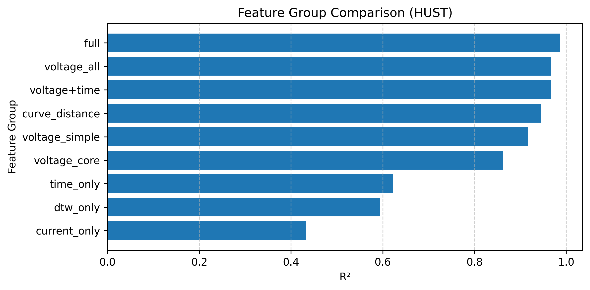
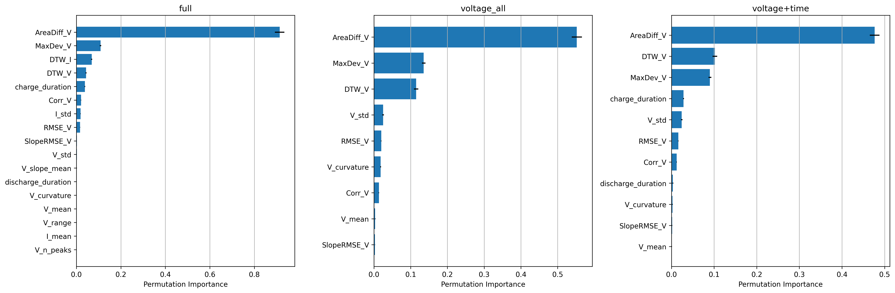
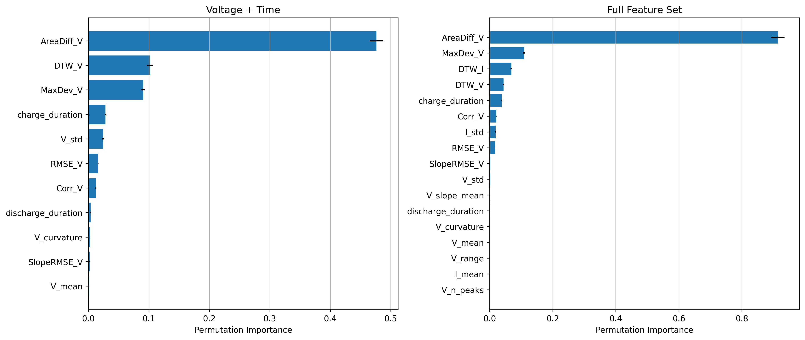

# Battery State of Health Prediction using Machine Learning

## Overview

This project investigates how machine learning can be used to predict the State of Health (SOH) of lithium-ion batteries from operational cycling data.

Instead of relying on direct capacity measurements, which require complete charge/discharge cycles, this project estimates SOH using electrical signals that are continuously available during battery operation, such as voltage, current, and time-derived features.

The project demonstrates an end-to-end data science workflow, including feature engineering, model development, hyperparameter optimization, and model interpretation.


## Project Goal

The objective of this project is to predict the State of Health (SOH) from operational battery data collected during charge/discharge cycles.

The target variable is

SOH = Remaining Capacity / Initial Capacity

where the battery capacity is calculated from the transferred charge (current integrated over time) during a cycle.

The models are trained using measurements such as

- Voltage
- Current
- Time
- Engineered statistical features

The ultimate goal is to estimate battery health without requiring direct capacity measurements.

## Features

- Battery SOH prediction using Random Forest regression
- Feature engineering from battery cycling data
- Evaluation of different feature groups
- Hyperparameter optimization with Grid Search
- Model evaluation using MAE and R²
- Feature importance analysis using Permutation Importance

## Dataset

This project uses the preprocessed **BatteryLife** dataset provided by the **BatteryML** project.

The following subsets are used:

- HUST
- Tongji (TJU)

The original datasets contain battery cycling measurements including

- Voltage
- Current
- Time

This project starts from the preprocessed data supplied by BatteryML. The focus is therefore on feature engineering, feature selection, machine learning, and model interpretation rather than raw data cleaning.

The engineered feature tables generated during preprocessing are stored in the `engineered_data/` directory.

## Requirements

- Python 3.13
- uv package manager

The project dependencies are defined in `pyproject.toml`.

## Installation

This project uses `uv` for dependency management.

Clone the repository:

```bash
git clone https://github.com/ChristophReimuth/battery-soh-prediction.git
cd battery-soh-prediction
```

Install dependencies and start Jupyter:

```bash
uv sync
uv run jupyter notebook
```

`uv run` automatically uses the project's virtual environment, no manual activation required.

<details>
<summary>Manual venv activation (optional)</summary>

If you prefer to activate the environment yourself:

```bash
uv sync

# Windows
.venv\Scripts\activate

# Linux / macOS
source .venv/bin/activate

jupyter notebook
```

</details>

## Usage

The project workflow is organized into three main notebooks:

1. **battery_soh_data_preprocessing.ipynb**
   - Load and preprocess the battery dataset
   - Perform data cleaning and preparation
   - Generate engineered features from battery measurement data
   - Export processed feature tables for model training

2. **baseline_model.ipynb**
   - Train a **Linear Regression** baseline model
   - Evaluate model performance using MAE and R²
   - Visualize predicted versus measured SOH values

3. **feature_importance.ipynb**
   - Train Random Forest regression models
   - Compare different feature groups and model configurations
   - Evaluate model performance
   - Analyze the contribution of individual features using Permutation Feature Importance

### Recommended workflow

Run the notebooks in the following order:

1. `battery_soh_data_preprocessing.ipynb`  
   → prepares the datasets and generates the required input features

2. `baseline_model.ipynb`  
   → establishes baseline model performance

3. `feature_importance.ipynb`  
   → performs advanced model comparison and feature analysis

## Project Workflow

```text
BatteryLife Dataset (BatteryML)
        │
        ▼
Data Preprocessing
        │
        ▼
Feature Engineering
        │
        ▼
Feature Group Definition
        │
        ▼
Random Forest Training
        │
        ▼
Grid Search Hyperparameter Optimization
        │
        ▼
Performance Evaluation (MAE, R²)
        │
        ▼
Permutation Feature Importance
        │
        ▼
Feature Interpretation
```


## Project Structure

```
.
├── engineered_data/
│   ├── processed_battery_features_HUST.pkl
│   └── processed_battery_features_Tongji.pkl
│
├── figures/
│   ├── feature_group_comparison_HUST.png
│   ├── permutation_report_vtime_full_HUST.png
│   └── permutation_top3_HUST.png
│
├── notebooks/
│   ├── battery_soh_data_preprocessing.ipynb
│   ├── baseline_model.ipynb
│   └── feature_importance.ipynb
│
└── src/
    └── battery_aging/
        ├── data_preprocessing.py
        ├── feature_engineering.py
        ├── model_functions.py
        └── __init__.py
```

## Machine Learning Pipeline


The machine learning pipeline consists of

- Feature engineering from battery cycling data
- Definition of multiple feature groups
- Random Forest regression
- Hyperparameter optimization using Grid Search
- Performance evaluation using MAE and R²
- Comparison of feature groups
- Interpretation using Permutation Feature Importance

The central research question is:

> Which engineered battery features provide the most accurate prediction of battery State of Health?

## Feature Groups

Several feature groups are evaluated to quantify the predictive value of different battery measurements.

The investigated groups include

- Voltage statistics
- Voltage curve similarity metrics (DTW, RMSE, Correlation, Area Difference, etc.)
- Current statistics
- Time-based features
- Combined feature sets

Each feature group is used to train an independently optimized Random Forest model.

## Results (HUST Dataset)

The project first establishes a **Linear Regression** baseline before evaluating more advanced **Random Forest** models with different engineered feature groups.

Model performance is evaluated using

- Mean Absolute Error (MAE)
- Coefficient of Determination (R²)

### Baseline Model (Linear Regression)

> **Note:** The results presented below are currently based on the **HUST** subset of the BatteryLife dataset. 

The baseline Linear Regression model achieved the following performance on the test set:

| Metric | Value |
|--------|------:|
| Mean Absolute Error (MAE) | **0.0174** |
| Coefficient of Determination (R²) | **0.9046** |

The baseline already demonstrates that the engineered features contain strong predictive information for battery State of Health (SOH), explaining approximately **90% of the variance** in the observed SOH values.

### Random Forest Models (HUST Dataset)

Random Forest regression models were subsequently trained using different feature groups and optimized via Grid Search. Their performance was compared to determine which engineered battery features provide the most accurate SOH prediction.


| Feature Group | MAE | R² |
|---------------|----:|---:|
| **Full Feature Set** | **0.0055** | **0.9865** |
| Voltage (All) | 0.0082 | 0.9670 |
| Voltage + Time | 0.0079 | 0.9663 |
| Curve Distance Features | 0.0108 | 0.9457 |
| Voltage Statistics | 0.0145 | 0.9165 |
| Core Voltage Features | 0.0202 | 0.8631 |
| Time Only | 0.0333 | 0.6225 |
| DTW Only | 0.0369 | 0.5939 |
| Current Only | 0.0405 | 0.4325 |

The **Full Feature Set** achieved the best performance with an **MAE of 0.0055** and an **R² of 0.9865**, substantially outperforming the Linear Regression baseline. Among the individual feature groups, voltage-based features provided the highest predictive power, while current-only and time-only features were considerably less informative.





### Permutation Feature Importance (HUST Dataset)

Permutation Feature Importance was used to interpret the Random Forest models and identify the features that contribute most to SOH prediction.

The analysis shows that **voltage curve similarity features** are the most informative predictors of battery State of Health. In particular, the **voltage curve area difference (AreaDiff_V)** consistently emerged as the dominant feature across all evaluated models. Other voltage-based similarity metrics, such as maximum deviation, Dynamic Time Warping (DTW), RMSE, and correlation, also contributed substantially to the model's performance.

By comparison, simple statistical descriptors of voltage and current, as well as time-based features, had a considerably smaller impact on the predictions, indicating that the overall shape of the voltage curve contains the most relevant information about battery degradation.

<p align="center">
  
</p>

A complete ranking of all engineered features is shown below.

<p align="center">
  
</p>


## Results (Tongji Dataset)

The same machine learning pipeline was evaluated on the **Tongji** subset of the BatteryLife dataset to assess the robustness of the proposed feature engineering approach across different battery datasets.

Model performance was evaluated using:

- Mean Absolute Error (MAE)
- Coefficient of Determination (R²)

### Baseline Model (Linear Regression)

> **Note:** The Tongji dataset results are evaluated independently from the HUST dataset. Due to differences in battery cells, measurement conditions, and degradation behavior, the absolute prediction performance is not directly comparable without considering dataset characteristics.

The Linear Regression baseline was used as a reference model before evaluating more advanced Random Forest models.

*(Insert Linear Regression results here if available.)*

### Random Forest Models (Tongji Dataset)

Random Forest regression models were trained using the same engineered feature groups as for the HUST dataset. The results show that feature combinations including voltage information and temporal information provide the most reliable SOH prediction capability.

| Feature Group | MAE | R² |
|---------------|----:|---:|
| **Voltage + Time** | **0.0470** | **0.5712** |
| **Full Feature Set** | **0.0472** | **0.5628** |
| Voltage Statistics | 0.0539 | 0.3506 |
| Voltage (All) | 0.0553 | 0.3170 |
| Core Voltage Features | 0.0576 | 0.2917 |
| Time Only | 0.0622 | 0.2564 |
| Current Only | 0.0718 | -0.0166 |
| DTW Only | 0.0738 | -0.0014 |
| Curve Distance Features | 0.0830 | -0.5324 |

The best-performing model on the Tongji dataset was the **Voltage + Time feature set**, achieving an **MAE of 0.0470** and an **R² of 0.5712**. The complete feature set achieved a very similar performance with an **MAE of 0.0472** and an **R² of 0.5628**.

Compared to the HUST dataset, the prediction accuracy is lower, indicating that the Tongji dataset presents a more challenging prediction task. Voltage-based features remain the most informative feature group, but individual voltage similarity metrics and current-based features provide limited predictive value when used alone.


### Permutation Feature Importance (Tongji Dataset)

Permutation Feature Importance was used to analyze which engineered features contribute most to the Random Forest predictions on the Tongji dataset.

The results show that **time-related discharge behavior and voltage curve similarity features dominate the SOH prediction**. In particular, **discharge duration** is by far the most influential feature for both the Voltage + Time model and the Full Feature Set model, indicating a strong relationship between battery aging and discharge behavior.

For the **Voltage + Time model**, discharge duration accounts for the majority of the predictive contribution, followed by voltage curve similarity metrics such as **Dynamic Time Warping (DTW_V)** and **RMSE_V**. Other voltage characteristics, including area difference, correlation, and slope-based features, provide only minor additional information.

The **Full Feature Set model** shows a similar pattern. Discharge duration remains the dominant feature, while **DTW_V** represents the second most important predictor. Current-based information contributes only marginally, with **DTW_I** and **I_std** providing smaller improvements compared to the dominant discharge and voltage-related features.

Compared to the HUST dataset, the Tongji results indicate a shift in feature importance: while voltage curve area differences were the strongest predictors for HUST, the Tongji dataset is primarily driven by **discharge duration and voltage curve alignment features**. This suggests that degradation characteristics differ between datasets and that the most informative features depend on the underlying battery population and measurement conditions.

<p align="center">
  
</p>

A complete ranking of all engineered features is shown below.

<p align="center">
  
</p>

## References

The battery data used in this project originates from the BatteryLife dataset developed by the BatteryML project [arXiv:2502.18807](https://arxiv.org/abs/2502.18807).

If you use this repository for research, please also cite the original dataset and the corresponding publications.

